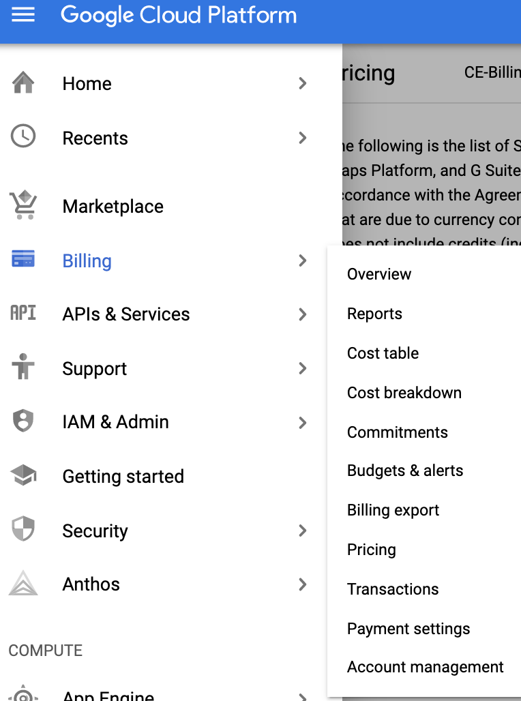

# GoogleCloudPriceList
This guide walks you through how to make use of GCP prices from your cloud console. This guide maybe useful for users that has a need to publish all GCP prices for their organization on a regular basis. This guide serves as a set of examples to filter, sort and export the GCP price data

Why do we need to do this? GCP has ~ 20,000 different SKUs available for end users to consume. For various organizations, it's often required to produce a list of usable SKUs as a part of RFP. This guide will help you get the prices filtered and arranged in the format that is required. 

Why do we use BigQuery? GCP has several price tiers for the same SKU. This repo attempts to guide users to filter out those products to have a single representation for a SKU

---
---

## Manual Process
this section guides you through the manual process to download, sort and export the GCP price data. Skip this section if you wish to automate the process

### Save Price List From GCP Console to local disk
As the project owner for GCP, open your browser to the [Cloud Console](https://console.cloud.google.com). From there, navigate to **Billing** and then select **Pricing**. In the pricing view select option to **View all SKUs** and validate that a table is populated below with approximately 21,000 rows. Select the **Download CSV** icon the save the price list to your local computer.

### Importing Data to BigQuery 
As BigQuery admin, open your browser to [BigQuery](https://console.cloud.google.com/bigquery/). If you have not created a **Dataset** before, create one by selecting your project and click on **Create Dataset**. 

With your dataset created, you can now import the downloaded CSV file from [previous section](#save-price-list-from-gcp-console-to-local-disk)

###### OPTIONAL: 
if you require additional filter for regional SKUS, i.e. US based only products, 

---

## Automated Process