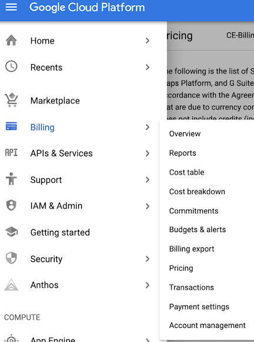
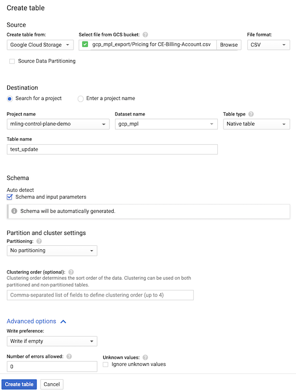

# Generating a custom Google Cloud Price List  
    
This guide walks you through how to make use of GCP prices from your cloud console. This guide maybe useful for users that has a need to publish all GCP prices for their organization on a regular basis. This guide serves as a set of examples to filter, sort and export the GCP price data

Why do we need to do this? GCP has ~ 20,000 different SKUs available for end users to consume. For various organizations, it's often required to produce a list of usable SKUs as a part of RFP. This guide will help you get the prices filtered and arranged in the format that is required. 

Why do we use BigQuery? GCP has several price tiers for the same SKU. This repo attempts to guide users to filter out those products to have a single representation for a SKU. Additionally BQ has a bunch of nice export tools to various data formats as well as connections to products like Google sheets. It offers us a good platform to store the data and connections for other people to use. 

---

## Manual Process  
this section guides you through the manual process to download, sort and export the GCP price data. Skip this section if you wish to automate the process

### Export Price List From GCP Console to local disk  
As the project owner for GCP, open your browser to the [Cloud Console](https://console.cloud.google.com). From there, navigate to **Billing** and then select **Pricing**. In the pricing view select option to **View all SKUs** and validate that a table is populated below with approximately 21,000 rows. Select the **Download CSV** icon the save the price list to your local computer.  
  
  
  
  
  
  
### Importing Data to BigQuery (BQ)  
As BigQuery admin, open your browser to [BigQuery](https://console.cloud.google.com/bigquery/). If you have not created a **Dataset** before, create one by selecting your project and click on **Create Dataset**.   

  

With your dataset created, you can now import the downloaded CSV file from [previous section](#Export-price-list-from-gcp-console-to-local-disk). With your **Dataset** selected, click on **Create Table** to start your import process. First select the location where the CSV was saved to as input. Once selected, the BQ should detect it as a CSV file. Next configure which table to save this data. In this example, we saved it to a new table by giving it a name for the table field. You can also use an existing table, however please make sure you over write existing data and make sure the data schema is correct. **Important** check ```auto detect schema and input parameters``` to save from manually creating the schema. Click **Create table** once you have completed your configuration.



Once the import is complete. You should see the table on the left navigation window. To validate data has been loaded, you can query the table by running below. You should see 1000 rows returned with GCP SKU information with the first query and total count of rows with the second. With the second query, you should expect ~ 21,000 rows. NOTE: you will need to change to query below with your table information. 

```
    SELECT * FROM `<update me dataset name>.<update me table name>` LIMIT 1000
```    
```
    SELECT count(*) FROM `<update me dataset name>.<update me table name>` 
``` 

### Filter different prices for SKUs  
There are couple scenarios where GCP offer different price points for products. GCP products (i.e. storage, API calls, Network egress ...) will have different price points based on consumption. GCP will often have a Free Tier where cost for consumption is $0.  

  

However for this guide, we will assume you need to find the **highest** rate for all SKUs for your reporting needs. To do that, we need to run a query in the table created [above](#importing-data-to-bigquery-bq). Since we are after the highest possible price point for the dataset, we can leverage SQL to query the data for those values. NOTE: you will need to change to query below with your table information.   

```
    SELECT 
        A.Google_service, A.Service_description, 
        A.SKU_ID, A.SKU_description, 
        A.Geo_taxonomy_regions, 
        A.Unit_description, 
        A.Per_unit_quantity, 
        A.List_price____ as USD  
    FROM `<update me dataset name>.<update me table name>` as A  
    inner join 
        (select SKU_ID as SKU, MAX(List_price____) as MAX_PRICE from `<update me dataset name>.<update me table name>` group by SKU_ID) as B 
    on 
        A.SKU_ID = B.SKU and 
        A.List_price____ = B.MAX_PRICE
```

you can see above that the query did not fetch every column rom the table. For this guide, I fetched columns necessary for my report. Please get familiar with the columns and adjust to your business requirements accordingly. You can change the order of the returned columns and names to conform to your data needs. I used a inner join based on SKU and Price leveraging the function [MAX](https://cloud.google.com/dataprep/docs/html/MAX-Function_57344665) in BQ. Once complete, you've successfully filtered the table to show unique SKUs with the highest Price listed. 

### OPTIONAL: Filter Geo based SKUs 
Continue with this section if you require additional filter for regional SKUS, i.e. US based only products.  

By default, the GCP price list does now show regions for the SKUs. However you can optionally include that field if you need to filter the SKUs by region. To do that, in [Previous Step](#Export-price-list-from-gcp-console-to-local-disk), click on the option to view all data fields and ensure **Geo taxonomy regions** is selected.  

  


Follow instructions to export and import the dataset to BQ previously. When previewing the data, you should now see a new column **Geo_taxonomy_regions** in your results.   

   

We'll adjust the query from the [SKUs filter](#Filter-different-prices-for-SKUs) to include an additional field for region. In the sample use case, we will filter for products only in **North America**  ```r"us|northamerica"``` in the query. You can adjust the query to look for other regions/zones based on your needs.  Note that there are quite a number of GCP SKUs that are not geo based. We include those SKUs in our example by including rows with **null** for **Geo_taxonomy_regions** column. In the query we use BQ function [REGEXP_CONTAINS](https://cloud.google.com/bigquery/docs/reference/standard-sql/functions-and-operators#regexp_contains) to look at the **Geo_taxonomy_regions** column for key words. We also use BQ function [LOWER](https://cloud.google.com/bigquery/docs/reference/standard-sql/functions-and-operators#lower) to handle casing differences if any. Once your query is executed, your result set will be filtered based on Geo of your selection. Use the example query below as reference:  

```
    SELECT 
        A.Google_service, 
        A.Service_description, 
        A.SKU_ID, A.SKU_description, 
        A.Geo_taxonomy_regions, 
        A.Unit_description, 
        A.Per_unit_quantity, 
        A.List_price____ as USD  
    FROM 
        `<update me dataset name>.<update me table name>` as A  
    inner join 
        (select SKU_ID as SKU, MAX(List_price____) as MAX_PRICE from `<update me dataset name>.<update me table name>` group by SKU_ID) as B 
    on 
        A.SKU_ID = B.SKU and 
        A.List_price____ = B.MAX_PRICE 
    where 
        (REGEXP_CONTAINS(LOWER(A.Geo_taxonomy_regions), r"us|northamerica") or 
        A.Geo_taxonomy_regions is null)
```  

  
### Export the results  
BQ makes export your query results very easy. Click on **Save Results** and select the format the location. Options are CSV, JSON, BQ table or clipboard.  

  


---

## Automated Process
**UNDER CONSTRUCTION**